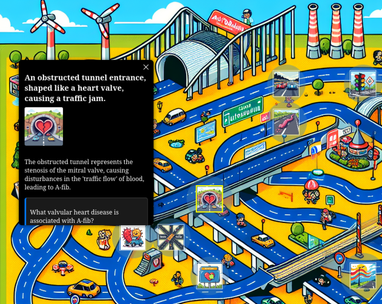

# Cranky — Visual Memory Palace Generator for Anki Cards

Cranky is an application designed for learners who want to deepen their understanding of difficult material by combining two powerful methods: spaced repetition and visual memory palaces.

By integrating directly with your Anki application, Cranky transforms your most challenging cards into symbolic, spatially organized scenes — memory palaces that help you remember not just the answers, but the concepts and thematic relationships behind them.

Cranky brings together the best of both worlds:
- The advantages of spaced repetition, provided by Anki
- The creativity and retention benefits of visual learning, powered by symbolic scene generation



---

## Why Cranky?


Traditional spaced repetition systems like Anki are highly effective at helping you retain isolated information. But for many learners, especially those tackling abstract, conceptual or complex material, repetition alone isn't enough.

Cranky adds structure to your knowledge, turning disconnected cards into  spatial representations. With Cranky, you place your concepts into environments, stories, and visual metaphors that engage the deeper mechanisms of memory: Association, imagery and narratives.

Whether you're a medical student trying to retain a web of diagnoses and mechanisms, or a learner navigating difficult and theoretical material, Cranky provides a way to anchor abstract knowledge in something more tangible.

Therefore it is not meant to be a replacement for your flashcards, but a experience that helps you rember difficult content. 

---

## How to Use

From the command line:

Default mode: request new cards and generate a new layout
```bash
python cranky.py
```

Use cached cards, but generate a new memory palace

```bash
python cranky.py --stored-cards
```

Use both cached cards and stored layout from the json file

```bash
python cranky.py --stored-scene --stored-cards
```


By default, Cranky generates memory palaces based on the 25 most difficult cards of the selected deck. 
Card creation can take several minutes due to server load and latency of API calls, so please be patient. 

---

## Important Notice on Data Privacy and Responsibility

When you use Cranky, the contents of your Anki cards—including front, back, and any linked media are transmitted to and stored on a remote server for the purpose of generating symbolic memory palace scenes. As part of this process, your data may be submitted to third-party services such as OpenAI and Replicate via their respective APIs.

You should only select and submit cards containing content you are comfortable sharing with these external providers.

The application provider does not operate or control these third-party services and make no guarantees about their data handling practices. By using Cranky, you acknowledge that you do so at your own discretion and risk. The application providers accept no responsibility for any loss, misuse, or harm arising from use of this tool.

---

*Cranky is designed for learners who want to visualize what they know and understand what they remember.*

contact: deep_intervention@posteo.de
